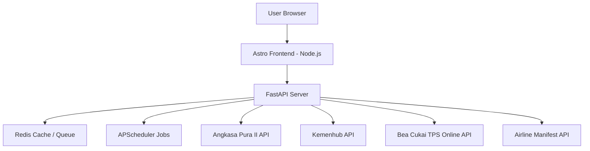
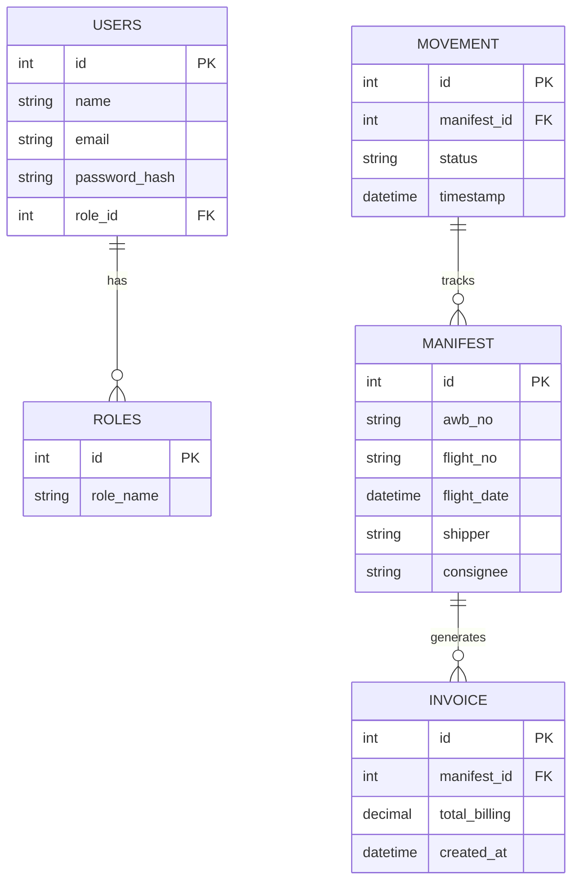
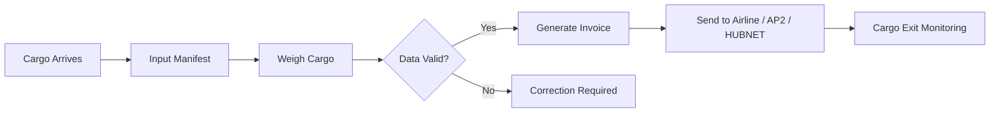
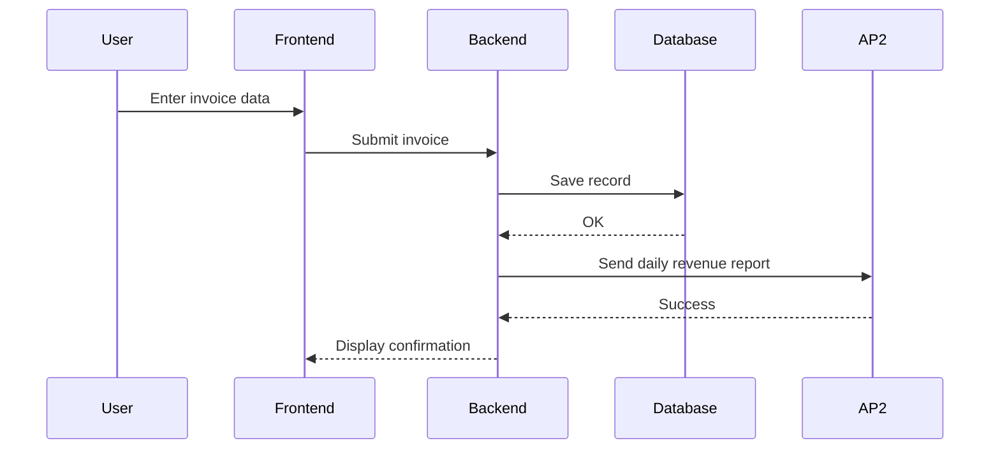
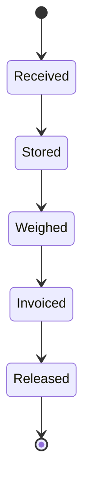

import MermaidClient from '../../../components/MermaidClient.astro';

<MermaidClient />


# APP MAU - Technical Documentation (ISO Standard)

## ✅ Technical Summary
APP MAU is a warehouse management system for Soekarno-Hatta Airport Line 1. It handles AP2 revenue reports, HUBNET tracking submissions, Customs monitoring, and CTOS warehouse operations. The system runs 24/7 using FastAPI, Astro, Redis, APScheduler, and secure authentication with SSL, JWT, firewall rules and role-based access.

---

## ✅ Network Architecture Diagram


---

## ✅ ERD Database


---

## ✅ BPMN Business Flow


---

## ✅ Sequence Diagram (Invoice Creation)


---

## ✅ State Machine (Cargo Process)


---

## ✅ Downtime / Disaster Recovery SOP
1. Monitoring detects service outage
2. Supervisor automatically restarts all services
3. If failed:
   ```bash
   sudo supervisorctl restart all
   sudo systemctl status redis
   sudo systemctl status nginx
   ```
4. If server fails completely:
   - Restore VM snapshot
   - Restore database backup

RTO: 5–10 minutes  
RPO: Daily backups

---

## ✅ Security Policy
- SSL, HTTPS enforced
- UFW firewall (80/443/22 only)
- SSH key authentication
- JWT authentication
- Role-based access
- Logging and auditing of all actions
