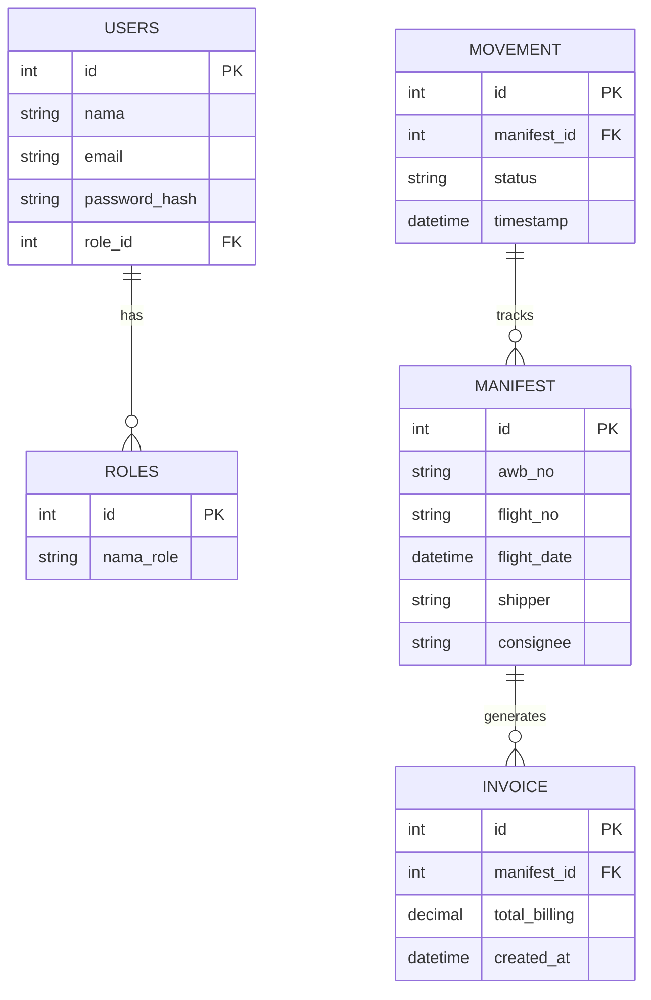
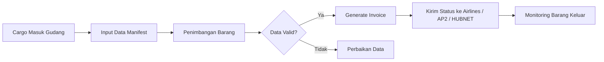
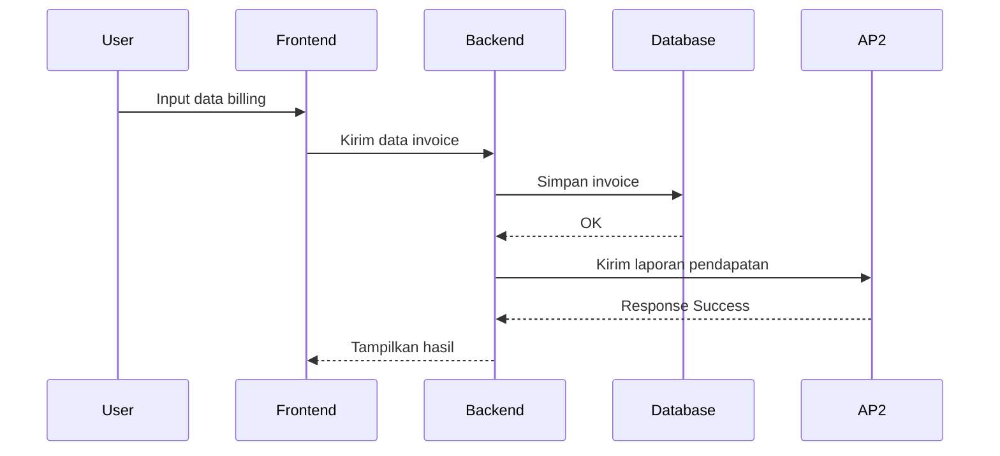
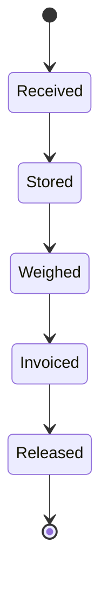

import MermaidClient from '../../../components/MermaidClient.astro';

<MermaidClient />

## ✅ Ringkasan Teknis
APP MAU adalah sistem manajemen gudang lini 1 Bandara Soekarno-Hatta, mencakup pelaporan ke AP2, HUBNET, Bea Cukai, dan operasional CTOS. Sistem bekerja 24/7 menggunakan FastAPI, Astro, Redis dan APScheduler, dengan keamanan berbasis SSL, JWT, firewall, dan role-based access.

---

## ✅ Diagram Arsitektur Jaringan
<div class="mermaid">
{`graph TD
    subgraph Client
        A[User Browser]
    end

    subgraph Frontend
        B[Astro Frontend - Node.js]
    end

    subgraph Backend
        C[FastAPI Backend]
        D[Redis Cache / Queue]
        E[APScheduler Jobs]
    end

    subgraph External Systems
        F[Angkasa Pura II API]
        G[Kemenhub HUBNET API]
        H[Bea Cukai TPS Online API]
        I[Airlines Manifest API]
    end

    A --> B --> C
    C --> D
    C --> E
    C --> F
    C --> G
    C --> H
    C --> I`}
</div>

---

## ✅ ERD Database


---

## ✅ BPMN - Workflow Bisnis


---

## ✅ Sequence Diagram (Proses Pembuatan Invoice)


---

## ✅ State Machine Diagram (Status Barang)


---

## ✅ SOP Downtime / Disaster Recovery
1. Sistem monitoring mendeteksi service mati → Kirim notifikasi
2. Supervisor auto-restart semua service
3. Jika gagal:
   ```bash
   sudo supervisorctl restart all
   sudo systemctl status redis
   sudo systemctl status nginx
   ```
4. Jika server rusak total:
   - Restore snapshot VM
   - Restore database dari backup harian

RTO: 5–10 menit  
RPO: backup harian

---

## ✅ Security Policy
- SSL aktif, HTTPS only
- Firewall hanya membuka 80/443/22
- Login server via SSH Key
- API pakai JWT
- Hak akses berdasarkan role
- Semua aktivitas dicatat di log


